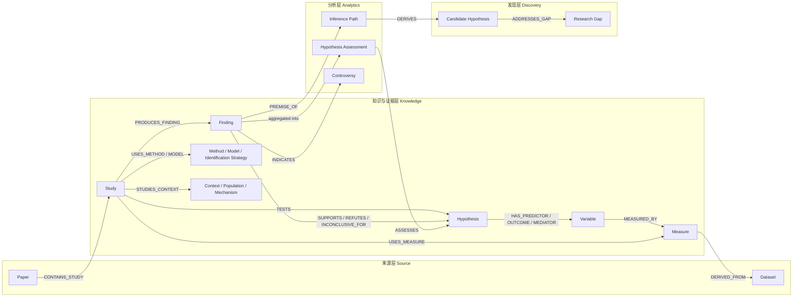

# Graph Schema

# 研究证据与假设推理图谱结构设计

本文定义面向绿色金融与 AI Scientist 场景的研究图谱结构。目标是把论文、研究单元、变量、测量、方法、假设和研究发现组织成可追溯、可计算、可跨文献推理的证据图，同时严格区分“原文事实”“统计归纳”和“系统推断”。读者不需要预先了解项目代码，按照本文的节点字典、关系字典和合法三元组即可理解或实现图谱。

> **最重要的建模约定：**论文是信息容器，Finding（研究发现）才是支持、反驳或未能支持某个 Hypothesis（假设）的最小证据单元。任何跨文献组合得到的新命题都只能进入 CandidateHypothesis（候选假设），不能直接写成原文事实。
> 
> 

**三元组定义：**图谱中的一条边统一表示为“源节点 \- 关系 \-\> 目标节点”。例如：`finding:F1 -SUPPORTS-> hypothesis:H1`。只有符合本文白名单的源类型、关系类型和目标类型组合才是合法三元组。



# 设计目标与基本原则

**证据可追溯。**每个关键节点和关系边都必须引用 evidence\_id，能够回到 document\_id、文档版本、chunk、页码或章节以及原文片段。被标记为 rejected 的证据不得支撑任何节点或边。

**以命题和发现为中心。**不把“X 影响 Y”直接压缩成全局真理。论文提出的是 Hypothesis，具体 Study 检验它并产生 Finding，Finding 再对 Hypothesis 表达支持、反驳或证据不足。

**变量角色属于具体研究。**同一个 Variable 在不同研究中可能是自变量、因变量、中介、调节、控制变量或工具变量。角色通过 Hypothesis/Finding 关系和 Study 上下文表达，不能固化在 Variable 节点类型中。

**原始事实与推断隔离。**extracted 表示文献明确陈述，curated 表示人工维护，computed 表示确定性计算，inferred 表示规则或模型推断。computed 和 inferred 对象必须保存 derivation，且不能覆盖 extracted 对象。

**保留冲突。**相互矛盾的研究结果分别保留为不同 Finding，并通过支持、反驳、未能支持和冲突关系聚合。系统不得用“多数票”删除少数结果。

**时间和版本明确。**图谱以 snapshot\_id 和 as\_of 标记知识截止时间；趋势、争议、综合判断和候选假设都必须引用输入图快照。

**区分追证与探索。**trace 模式只走类型受控、证据门槛明确的确定性路径；explore 模式借鉴 SciAgents 的多路径或多样性采样，用于发现跨领域连接，但输出只能是待验证候选。

# 总体分层结构

> **图示说明：**架构关系已在下方节点、关系与合法三元组表中完整展开；正文写入完成后可按需另行补充画板。
> 
> 

# 节点字典

## 3\.1 来源层节点

## 3\.2 知识与研究执行节点

## 3\.3 命题与证据节点

## 3\.4 分析层节点

## 3\.5 发现层节点

## 3\.6 Evidence 与 Derivation：一等记录但不是节点

**Evidence。**完整证据统一保存在图谱顶层 evidence 数组中，节点和边只保存 evidence\_ids。建议字段包括 source\_type、evidence\_type、evidence\_level、source\_document\_id、document\_version、content、content\_hash、published\_at、retrieved\_at、verification\_status，以及页码、章节、字符区间或表格行列定位。

**Derivation。**所有 computed 或 inferred 节点和边必须保存 method、method\_version、input\_snapshot\_id、input\_node\_ids、input\_edge\_ids、parameters、prompt\_hash 和 code\_ref，使任何分析或推断都能够复算。

# 关系边字典与合法三元组

下列白名单同时定义每条边的含义和合法端点。表中用“\|”表示可选类型。例如 `Paper|Study` 表示源节点可以是 Paper 或 Study。未列出的组合一律非法，应由校验器拒绝。

## 4\.1 来源、作者、引用和政策结构

## 4\.2 论文、研究单元与研究设计

## 4\.3 假设、发现、变量与测量

## 4\.4 研究版图与分析关系

## 4\.5 研究空白与候选假设

## 4\.6 Taxonomy、归一和方法适用性

# 全局合法性规则

## 5\.1 结构和端点规则

1. 节点、边和 Evidence ID 必须全局唯一；每条边的 source 和 target 必须引用当前快照中存在且未被 rejected 的节点。

2. 每条边必须匹配第 4 章的合法三元组白名单。即使关系名称合理，只要端点类型不匹配也必须拒绝。

3. 边的 layer 必须与其语义一致：来源元数据属于 Source；论文事实和研究设计属于 Knowledge；综合、趋势和推理属于 Analytics；Gap 和 CandidateHypothesis 属于 Discovery。

4. 反向关系不自动存储。查询层可以计算 inverse view，但图内只保存约定方向，避免双份边不一致。

## 5\.2 来源、证据和推导规则

1. origin=extracted 的节点和边必须至少引用 primary\_source 或 metadata 级 Evidence。

2. origin=computed 或 inferred 的节点和边必须具有 derivation，并列出所有输入节点、输入边、算法或规则版本、参数、输入快照和 prompt\_hash。

3. 设计文档可以支撑 curated taxonomy，但 evidence\_level=design 的内容不能支撑论文发现、支持边或候选假设。

4. 被 rejected 的 Evidence 保留用于审计，但任何有效节点或边都不得引用它。

5. 同一结论由一篇论文中的多个相近模型得到时，综合评分按 Study/Paper 去重，防止把同源结果当成多篇独立证据。

## 5\.3 实体归一规则

Paper、Study、Finding 和 Limitation 属于来源约束实体：Study、Finding 和 Limitation 必须按论文隔离。Variable、Theory、Mechanism、Method、Model、IdentificationStrategy、Dataset、Topic 等可以跨论文归一，但只能通过权威 ID、人工词表或高置信实体链接合并。

Hypothesis 不能仅凭自然语言句子相似就合并。推荐的 canonical\_signature 至少包含 predictor\_ids、outcome\_ids、relation\_kind、expected\_direction、mediator\_ids、moderator\_ids 和 boundary\_scope。边界条件不同但核心命题相近时，应保留多个节点并用 RELATED\_TO 或“候选细化关系”表达。

Measure 的身份必须包含 construction\_hash。即使名称相同，只要公式、单位、缩放方向、数据字段或时间聚合不同，就应保留为不同 Measure。

## 5\.4 支持、反驳和冲突规则

1. SUPPORTS、REFUTES 和 INCONCLUSIVE\_FOR 的合法方向固定为 Finding \-\> Hypothesis，不允许 Paper \-SUPPORTS\-\> Hypothesis。

2. 统计不显著默认映射为 INCONCLUSIVE\_FOR，而不是 REFUTES。只有方向相反、精度充分且研究设计能够区分假设时才可标为 REFUTES。

3. SUPPORTS 不具有传递性。F1 支持 H1、H1 与 H2 相关，不代表 F1 支持 H2。

4. CITES 不代表支持；contrasts、extends 等引用语境可以保存在 CITES 边属性，但不能替代 Finding 级证据立场。

5. CONTRADICTS 必须比较相同或可映射的命题，并通过 Context、Population、Measure 和 IdentificationStrategy 的兼容性检查。

## 5\.5 时间、层级和推理安全规则

1. SUBTOPIC\_OF 必须构成无环层级；SAME\_AS 只连接同类型实体。

2. AMENDS 和 SUPERSEDES 必须满足有效时间顺序，且不能把旧政策节点删除。

3. MEASURED\_BY 只表示测量映射，不能被当成因果关系参与机制链。

4. CandidateHypothesis、InferencePath、HypothesisAssessment、TrendSnapshot 和 Controversy 必须绑定 graph\_snapshot\_id 和 as\_of。

5. 默认 max\_inference\_depth=1。未经人工验证的推断不得继续作为下一轮推断前提，避免推断级联。

6. 完整证据路径可允许最多 8 跳，但只能匹配命名 path\_template；不得使用无类型约束的任意随机游走生成事实答案。

## 5\.6 合法与非法示例

# 跨文献间接推理

## 6\.1 两种检索模式

**trace 模式。**用于回答“哪些研究支持或反驳某个假设”“某个变量如何测量”等追证问题。采用确定性、类型受控的路径模板，优先高质量 Evidence，返回完整论文、Study、Finding 和原文定位。

**explore 模式。**用于 SciAgents 式跨领域发现。可使用 k\-shortest、diverse path 或带随机种子的多样性采样连接相距较远的概念，但必须记录 sampling\_strategy 和 random\_seed，输出只能进入 CandidateHypothesis，不能作为事实答案。

## 6\.2 机制链组合规则

```Plain Text
前提 1：Finding F1 SUPPORTS Hypothesis H1
H1：X -> M

前提 2：Finding F2 SUPPORTS Hypothesis H2
H2：M -> Y

守卫条件：
- F1 与 F2 来自不同 Paper
- 两处 M 为同一规范 Variable 或已人工核验 SAME_AS
- Context、Population、时期和测量具有足够可比性
- 识别强度达到规则阈值
- 不存在足以阻断该链的直接反证

结论：生成 CandidateHypothesis H3：X -> Y，M 为候选中介
origin=inferred；保存 F1、H1、F2、H2 及全部输入边
```

上述结论只表示“值得验证的机制链”，不表示 X 已被证实导致 Y。H3 必须同时连接支持证据和挑战证据，并列出跨研究情境不一致带来的假设条件。

## 6\.3 其他白名单推理模板

## 6\.4 推理路径必须保存的字段

每个被物化的 InferencePath 至少保存 path\_type、node\_ids、edge\_ids、premise\_evidence\_ids、conclusion、assumptions、counterevidence\_ids、context\_compatibility、identification\_strength、source\_diversity、score\_components、graph\_snapshot\_id、rule\_id、rule\_version、random\_seed、review\_status 和 materialization\_status。

# 单篇论文如何绘制图谱：完整示例

以下为教学用虚构论文，用于说明构图过程，不代表真实文献结论。

**论文标题：**《ESG 绿洗与企业融资成本：信息不对称的中介作用》

**研究设计：**使用 2012\-2022 年中国 A 股上市公司面板数据，采用双向固定效应模型和中介效应分析。ESG 绿洗由“披露得分与实际绩效之差”测量；融资成本由“利息支出/平均有息负债”测量；信息不对称由分析师预测分歧度测量。

**论文假设：**H1：ESG 绿洗提高企业融资成本。H2：信息不对称在 ESG 绿洗与融资成本之间发挥中介作用。

**论文结果：**F1：ESG 绿洗系数为正且显著，支持 H1。F2：加入信息不对称后，绿洗系数下降且间接效应显著，支持 H2。

## 7\.1 第一步：建立节点

## 7\.2 第二步：建立合法关系边

```Plain Text
paper:p001 -CONTAINS_STUDY-> study:p001_s1
paper:p001 -PROPOSES_HYPOTHESIS-> hypothesis:h1
paper:p001 -PROPOSES_HYPOTHESIS-> hypothesis:h2

study:p001_s1 -TESTS_HYPOTHESIS-> hypothesis:h1
study:p001_s1 -TESTS_HYPOTHESIS-> hypothesis:h2
study:p001_s1 -USES_METHOD-> method:panel_regression
study:p001_s1 -USES_METHOD-> method:mediation
study:p001_s1 -USES_MODEL-> model:twfe
study:p001_s1 -USES_DATASET-> dataset:csmar
study:p001_s1 -USES_DATASET-> dataset:esg_rating
study:p001_s1 -STUDIES_POPULATION-> population:a_share_firms
study:p001_s1 -STUDIES_CONTEXT-> context:china_2012_2022

hypothesis:h1 -HAS_PREDICTOR-> variable:greenwashing
hypothesis:h1 -HAS_OUTCOME-> variable:financing_cost
hypothesis:h2 -HAS_PREDICTOR-> variable:greenwashing
hypothesis:h2 -HAS_MEDIATOR-> variable:information_asymmetry
hypothesis:h2 -HAS_OUTCOME-> variable:financing_cost
hypothesis:h2 -HAS_MECHANISM-> mechanism:information_asymmetry

variable:greenwashing -MEASURED_BY-> measure:gw_gap
variable:information_asymmetry -MEASURED_BY-> measure:forecast_dispersion
variable:financing_cost -MEASURED_BY-> measure:interest_cost
measure:gw_gap -DERIVED_FROM-> dataset:esg_rating
measure:forecast_dispersion -DERIVED_FROM-> dataset:csmar
measure:interest_cost -DERIVED_FROM-> dataset:csmar

study:p001_s1 -PRODUCES_FINDING-> finding:p001_f1
study:p001_s1 -PRODUCES_FINDING-> finding:p001_f2
finding:p001_f1 -SUPPORTS-> hypothesis:h1
finding:p001_f2 -SUPPORTS-> hypothesis:h2
```

## 7\.3 第三步：形成可读图

> **图示说明：**架构关系已在下方节点、关系与合法三元组表中完整展开；正文写入完成后可按需另行补充画板。
> 
> 

## 7\.4 第四步：把结果属性和原文证据放到正确位置

Finding F1 节点保存 claim、effect\_direction=positive、significance=significant、样本与条件；F1\-SUPPORTS\-H1 边保存 support\_kind=empirical、directness=direct、identification\_strength=associational，以及对应 evidence\_ids。Study S1\-USES\_METHOD\-双向固定效应模型边保存 role=baseline；变量定义和具体操作化放在 Study\-USES\_VARIABLE/USES\_MEASURE 边上下文，而不是覆盖全局 Variable。

每一项 evidence\_id 都应能回到论文中的假设发展、数据与方法、回归结果或结论段。例如 F1 的证据可定位到“表 4 基准回归，第 2 列”和对应正文；H1 的证据定位到假设发展章节。这样读者点击任一支持边，都能看到“哪篇论文、哪个 Study、哪条 Finding、什么方法和什么原文”支撑该判断。

## 7\.5 扩展到第二篇论文后的跨文献推理

假设另一篇论文 P002 报告“信息不对称显著提高企业债务融资成本”，其 Finding F3 支持 Hypothesis H3：信息不对称 \-\> 融资成本。系统发现示例论文的 H2 包含“绿洗 \-\> 信息不对称”，P002 的 H3 包含“信息不对称 \-\> 融资成本”，中间变量实体一致且两项研究情境可比，于是可以创建 InferencePath，并生成 CandidateHypothesis：“ESG 绿洗可能通过信息不对称提高融资成本”。

该候选假设必须标记 origin=inferred，并连接 F2、H2、F3、H3 及其证据；如果已有论文直接检验并确认同一完整机制，则新颖性检查应把它标为已覆盖，而不是继续声称为新假设。

# Schema 和实现落地建议

## 8\.1 最小验收标准

1. 随机抽取至少 10 条 Finding、SUPPORTS/REFUTES 边，均能回到原文位置。

2. 所有非法端点组合都被校验器拒绝，包括 Paper\-SUPPORTS\-Hypothesis 和 Variable\-MEASURED\_BY\-Dataset。

3. 非显著结果不会自动生成 REFUTES。

4. 同一论文多个模型不会被统计为多篇独立证据。

5. 跨文献候选假设完整保存前提、反证、守卫条件、快照和规则版本。

6. trace 查询能返回证据链，explore 查询只返回 Discovery 层候选。

