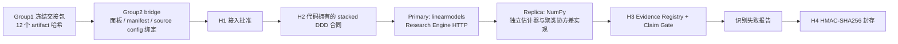

# Group1 → Group2 后端真实链路验收

日期：2026-08-12

结论：工程链路已经完成真实执行、独立估计器复现和 H4 封存；科学状态为 `limited`，冻结的 sign-switch 因果假设未获准。

## 验收结果

| 项目 | 结果 |
| --- | --- |
| Workflow run | `1d0a03cc-b0c1-45a7-abcc-c9a70facd7d5` |
| Group1 handoff | `group1-handoff:5b5a77e9b21793e05f4e5dd5` |
| H1 / H2 / H3 / H4 | `approve` / `approve` / `generate_identification_failure_report` / `approve` |
| 设计候选 | `candidate-direct_baseline` |
| Model provider | `code_owned`，无外部 LLM 调用 |
| Execution mode | `external`，本机 HTTP Research Engine |
| Primary research run | `research-8dcd1d91-dc93-4f01-965d-9c313fdf5fc9` |
| Replication run | `replication-3def283f-02fb-414e-acc9-29a261215b1c` |
| Reproduction audit | `matched`，无估计差异 |
| 工程状态 | `succeeded` |
| 科学状态 | `limited` |
| H3 主张 | 5 条全部 `reject` |
| H4 seal | `963e6ccd4be8dd5e87dec1fb8b6c7c124fbb78d11fe5e177255ab3ef0155454e` |

本机完整回执位于 `backend/var/group1_execution/acceptance-1d0a03cc-b0c1-45a7-abcc-c9a70facd7d5.json`。`backend/var` 按仓库规则不进入 Git，本文件只保留公开验收摘要。

## 实际链路



Group1 原交接包保持只读。桥接层先验证 Group1 manifest 和 12 个 artifact 的 SHA-256，再验证执行面板、面板 manifest 与 source config 的相互哈希绑定，最后将 `DatasetRef` 注册到 Group2 私有数据 registry。

界面曾显示的 `H0 blocked / No executable dataset_refs` 是旧 run 的真实历史状态，没有被覆盖。本次验收创建了独立的新 run。

## 数据与执行面板

- Group1 manifest SHA-256：`6851d7b512494c24488fc5a5883f27779f810e12b277dce0b6ee4dec1711404c`；
- 总计验证 12 个 artifact；
- 最终堆叠面板：8,640 行、34 列、2,725,934 bytes；
- 面板 SHA-256：`6d1d8569de8b32e842c9b9373bd9844612467ba6c094382cf62942d97f469566`；
- 排除收养年后用于估计：8,626 行；企业聚类数 650；
- 2017 cohort：31 个 treated、262 个 control；
- 2019 cohort：1 个 treated、296 个 control。

真实数据来源、许可边界、政策日期和试点区域在 `backend/config/group1_execution_sources.json` 中版本化；原始数据文件不随公开仓库分发。

## 冻结估计与复现

主实现：`linearmodels-stacked-cohort-ddd-v1`。

复现实现：`numpy-stacked-cohort-ddd-v1`。

两者均执行 paired-outcome stacked cohort continuous-capacity DDD、固定效应、企业聚类有限样本修正、严格处理前 PKU capacity、event time `[-5, 4]`、joint pretrend、边际政策效应和冻结 sign-switch 判据。

复现审计为 `matched`。独立性范围是 `estimator_only`：估计器和聚类协方差实现独立，但数据校验、regressor construction、event-time 与 marginal-effect contrasts 仍共享，因此不得表述为端到端独立复现。

## 科学判定

冻结规则要求两项 outcome 在低/高 capacity 下同时发生规定的符号转换。实际执行不支持该规则：

- 两项 outcome 的低、高 capacity 点估计均未形成要求的 sign switch；
- emissions intensity 的零交点不在 treated support 内；
- H3 将 sign-switch evidence 标记为 `opposed`；
- 5 条候选主张全部拒绝，并生成 identification failure report。

joint pretrend 未被拒绝只表示当前检验未发现显著前趋势，不能证明 parallel trends。

## 科学发布仍受限

1. 2019 cohort 只有 1 个 treated firm，低于预注册最小值 5；
2. 35 个 treated firm 使用地级市 proxy，需要企业地址到子地级试点边界的精确匹配；
3. 两个外部数据集再分发前仍需完成 third-party-content 权利复核；
4. `firm_emission_intensity` 的碳排变换与分母口径需要再次确认；
5. R&D、绿色专利和 EPIE 不在本次面板中，本 run 不支持机制结论。

这些事项不阻碍工程验收，但阻碍论文级因果发布。修复后应创建新合同和新 run，不能在看到本次结果后原地修改阈值。

## 重跑

```powershell
python backend\scripts\build_group1_execution_panel.py
python -m uvicorn hypoweaver.research_api:app --app-dir backend\src --host 127.0.0.1 --port 8001
$env:PYTHONPATH='backend\src'
python backend\scripts\run_group1_group2_acceptance.py
```

验收 runner 固定使用 `model_provider=code_owned`，不会向外部大语言模型发送项目输入。Qwen 或其他模型的替换与比较应作为独立模型契约处理。
