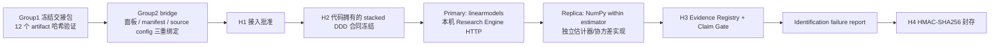

# Group1 → Group2 后端真实链路验收

日期：2026-08-12

结论：工程链路已跑通并封存；科学状态为 `limited`，冻结的 sign-switch 因果假设未获准。

## 1. 验收终态

| 项目 | 结果 |
| --- | --- |
| Workflow run | `1d0a03cc-b0c1-45a7-abcc-c9a70facd7d5` |
| Group1 handoff | `group1-handoff:5b5a77e9b21793e05f4e5dd5` |
| H1 / H2 / H3 / H4 | `approve` / `approve` / `generate_identification_failure_report` / `approve` |
| 设计候选 | `candidate-direct_baseline` |
| Model provider | `code_owned`，无外部 LLM 调用 |
| Execution mode | `external`，通过本机 HTTP Research Engine 执行 |
| Primary research run | `research-8dcd1d91-dc93-4f01-965d-9c313fdf5fc9` |
| Replication run | `replication-3def283f-02fb-414e-acc9-29a261215b1c` |
| Reproduction audit | `matched`，无差异 |
| 工程状态 | `succeeded` |
| 科学状态 | `limited` |
| H3 主张决策 | 5 条候选主张全部 `reject` |
| H4 seal | `963e6ccd4be8dd5e87dec1fb8b6c7c124fbb78d11fe5e177255ab3ef0155454e` |

本机完整验收回执位于：

`backend/var/group1_execution/acceptance-1d0a03cc-b0c1-45a7-abcc-c9a70facd7d5.json`

`backend/var` 按仓库规则不进入 Git；本文件保留可公开提交的验收摘要和重跑方法。

## 2. 实际打通的边界



Group1 原交接包保持只读。桥接层先验证 Group1 manifest 和 12 个 artifact 的 SHA-256，再验证执行面板、面板 manifest、source config 的相互哈希绑定，最后将 DatasetRef 注册到 Group2 数据注册表。

此前界面中显示的 `H0 blocked / No executable dataset_refs` 是旧 run 的真实历史状态；它没有被篡改。此次验收创建了一个新的可执行 run。当前前端已通过生产构建，但“在界面中选择面板/manifest/source config 并启动验收”仍属于下一阶段产品交互工作。

## 3. 数据与冻结样本

### 3.1 Group1 交接完整性

- manifest SHA-256：`6851d7b512494c24488fc5a5883f27779f810e12b277dce0b6ee4dec1711404c`
- 交接 artifacts：2 个
- source artifacts：10 个
- 合计验证：12 个

### 3.2 真实来源

- ESG greenwashing：Mendeley Data `10.17632/4yckzvjzcc.1`，源文件 SHA-256 `d68b4084ea60e354714815208d7ba6ee1d88a8b3f4d3ce3050d8298cf241bb73`。
- 企业直接碳排：Mendeley Data `10.17632/n8k6ss8hcg.2`，源文件 SHA-256 `aa3ca94dd36e9cc27f93f20f2731e1617279cd773cf058ce7d684c008e49a7b9`。
- 北京大学数字普惠金融指数：2011–2023 workbook SHA-256 `8b917b63dfcf90b40373e0408bd29c6067d0db53ccb932f5662f0c0c8c70a033`；地级市提取 SHA-256 `dfc431d76b6f7b6e69440b31e7f74a41d2cc66b6a66a13a7f842f60af1bcc166`。
- 政策批次：2017、2019；2022 批次只作为样本结束前的 not-yet-treated 对照。
- 收养年处理：排除 adoption year，下一自然年起计入 post。

来源、许可边界、政策日期和试点区域在 `backend/config/group1_execution_sources.json` 中版本化。

### 3.3 配对堆叠面板

- 精确 `stock_code + year` 合并后：7,078 个配对 firm-year、854 家企业。
- 最终堆叠面板：8,640 行、34 列、3,725,934 bytes。
- 面板 SHA-256：`6d1d8569de8b32e842c9b9373bd9844612467ba6c094382cf62942d97f469566`。
- `(stack_cohort_year, firm_id, year)` 唯一；两项 outcome 完整且样本一致。
- 排除收养年后用于估计：7,626 行；企业聚类数 650。
- 2017 cohort：41 个 treated、562 个 control。
- 2019 cohort：1 个 treated、496 个 control。

## 4. 冻结估计与复现

主实现：`linearmodels-stacked-cohort-ddd-v1`。

复现实现：`numpy-stacked-cohort-ddd-v1`。

两者均执行：

- paired-outcome stacked cohort continuous-capacity DDD；
- `stack_entity_id` 与 `stack_time_id` 固定效应；
- `firm_id` 聚类、有限样本修正标准误；
- 严格处理前 PKU capacity；
- event time `[-5, 4]`、`-1` 为参照；
- 低/高 capacity 边际政策效应及零交点；
- joint pretrend；
- 代码冻结的 paired sign-switch 判据。

复现审计为 `matched`，系数和标准误在冻结容差内无差异。独立性范围为 `estimator_only`：估计器与聚类协方差实现独立，但数据校验、regressor construction、event-time 和 marginal-effect contrasts 仍共享。因此不得表述为端到端独立复现。

## 5. 执行输出与科学判定

以下数值是执行证据，不是获准因果结论。

| Outcome | policy exposure | policy × capacity | joint pretrend p | low-capacity effect | high-capacity effect |
| --- | ---: | ---: | ---: | ---: | ---: |
| Greenwashing gap | 0.03102 (SE 0.18711) | 0.02209 (SE 0.22535, p=0.92193) | 0.60626 | 0.02520 (p=0.87974) | 0.04526 (p=0.87481) |
| Firm emission intensity | 0.03074 (SE 0.04229) | -0.04214 (SE 0.05511, p=0.44452) | 0.84999 | 0.04185 (p=0.29838) | 0.00357 (p=0.95486) |

冻结的“低 capacity 为正、高 capacity 为负、两项 outcome 同时换符号”规则没有满足：

- greenwashing 的低、高 capacity 点估计均为正；
- emissions intensity 的低、高 capacity 点估计也均为正；
- greenwashing 零交点虽在 treated support 内，但方向和 DDD slope 均不支持规则；
- emissions intensity 零交点不在 treated support 内；
- H3 因此把 sign-switch 证据标记为 `opposed`，5 条候选主张全部拒绝。

joint pretrend 未被拒绝只说明当前检验未发现显著前趋势，不能证明 parallel trends。

## 6. 科学发布仍被阻断的事项

1. 2019 cohort 只有 1 个 treated firm，低于预注册最小值 5。
2. 35 个 treated firm 使用地级市 proxy；赣江新区、花都区、贵安新区、兰州新区等需要企业地址到子地级试点边界的精确匹配。
3. 两个 Mendeley 数据集在再分发前仍需完成 third-party-content 权利复核。
4. `firm_emission_intensity` 当前工程构造需与源作者的精确碳排变换和分母口径再次确认。
5. R&D、绿色专利和 EPIE 不在本次配对执行面板内；本 run 不支持机制结论。

这些事项不阻碍工程验收，但阻碍论文级因果发布。修复后应创建新合同和新 run，不得在看到本次结果后原地改阈值并把重跑当作同一次确认性实验。

## 7. 重跑命令

在仓库根目录执行：

```powershell
python backend\scripts\build_group1_execution_panel.py
```

启动本机 Research Engine：

```powershell
python -m uvicorn hypoweaver.research_api:app --app-dir backend\src --host 127.0.0.1 --port 8001
```

另一个终端执行完整 H1–H4 验收：

```powershell
$env:PYTHONPATH='backend\src'
python backend\scripts\run_group1_group2_acceptance.py
```

验收 runner 固定使用 `model_provider=code_owned`，不会向外部大模型发送项目输入。需要替换或评估 Qwen/其他大模型时，应作为后续单独产品/模型合同处理。

## 8. 验证记录

- Group1→Group2 集成回归：192 tests，全部通过。
- 后端完整回归：567 tests，全部通过。完整套件需在测试子进程内屏蔽已配置的运行时凭据，避免 `runtime_config` 隔离测试继承团队环境。
- 前端：`npm run build` 通过；TypeScript 检查通过；Vite 生产构建成功。
- `git diff --check`：通过。

Git 基线：`bdbd21ccf599c701778001d176de5d278229d08c`（`chore: establish validated HypoWeaver baseline`）。
