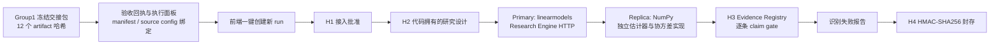

# Group1 → Group2 前端真实链路验收

日期：2026-08-13

结论：用户现在可以从 HypoWeaver 前端直接启动已经通过工程验收的 Group1 数据包，经 H1–H4 人工门控完成 Group2 真实执行、独立估计器复现、主张审查与封存。工程链路通过；本次数据的科学状态仍为 `limited`，5 条候选主张全部被拒绝。

## 1. 本阶段交付

- 增加只读的“已验收 Group1 数据包”检查接口，不向前端泄露本地绝对路径。
- 增加一键创建新真实运行的接口；旧运行及失败历史不会被覆盖。
- 前端新建研究页显示数据包哈希、面板规模、执行方式和复现状态，并可一键进入 H1。
- 运行页在顶部明确区分工程执行、独立复现、科学状态、主张闸门和 H4 封存。
- 完成态不再自动滚到页面底部，用户打开运行即可看到最终结论。
- 手动路径接入保留为高级入口，并明确提示：缺少执行面板绑定时会 fail closed。
- 存储配额遍历忽略 `.render-*` 渲染器临时目录，避免残留临时目录阻断新运行。

## 2. 浏览器真实验收

| 项目 | 结果 |
| --- | --- |
| Workflow run | `a8332fe2-33bf-4338-a7b5-309e539c47aa` |
| Group1 artifacts | 12 个，全部重新校验哈希 |
| 执行面板 | 8,640 行 × 34 列 |
| H1 / H2 / H3 / H4 | `approve` / `approve` / `generate_identification_failure_report` / `approve` |
| 设计候选 | `candidate-direct_baseline` |
| Model provider | `code_owned` |
| Execution mode | `external`，本机 Research Engine HTTP |
| Primary research run | `research-ef0ce8a6-f4ad-489c-b27b-07426ff22346` |
| Replication run | `replication-dcdfe1a6-eba4-4338-80e6-1f880a93d6c5` |
| Reproduction audit | `matched`，范围为 `estimator_only` |
| 工程状态 | `succeeded` |
| 科学状态 | `limited` |
| H3 主张 | 0 通过 / 5 拒绝；sign-switch evidence 为 `opposed` |
| H4 seal | `8989fc35d491b96339e0d0c919e0fda6ea3cc5449c54a2b313506606f0400eef` |

完整本机回执：

`backend/var/group1_execution/acceptance-a8332fe2-33bf-4338-a7b5-309e539c47aa.json`

最终界面截图：

`backend/var/product-audit/verified-run-completed-top.png`

上述 `backend/var` 文件按仓库规则不进入 Git；本文件只记录可公开提交的验收摘要和定位信息。

## 3. 实际链路

接口：

- `GET /api/v1/group1-handoffs/local/verified-bundle`
- `POST /api/v1/group1-handoffs/local/verified-bundle/runs`

服务端会在每次检查和创建运行时重新验证 Group1 handoff、执行面板、执行 manifest、source config 和最近一次验收回执之间的哈希绑定。任何缺失或不一致都会返回不可启动状态。

## 4. 验收中暴露并修复的问题

### 4.1 渲染临时目录导致创建运行返回 500

首次点击一键启动时，存储配额扫描遇到历史 figure renderer 留下且当前进程无权读取的 `.render-*` 临时目录。该目录不是持久产物，却导致 `directory_size_bytes` 抛出 `PermissionError`。

处理：配额计算明确排除 `.render-*` 临时目录，并增加回归测试。历史目录没有被删除。

### 4.2 Research Engine 端口配置不一致

前端首次创建出的运行 `de3cfe5a-6fe8-4991-a6f8-84cb9f629282` 在 H2 后真实失败：运行时配置指向 `127.0.0.1:9000`，实际 Research Engine 监听 `127.0.0.1:8001`。

处理：将本机忽略的运行时配置修正为 `http://127.0.0.1:8001`，随后创建全新的运行完成验收。失败运行保留在历史记录中，没有篡改或覆盖。

## 5. 回归验证

- 后端完整回归：571 tests，全部通过。
- Group1 handoff 定向回归：9 tests，全部通过。
- 存储配额定向回归：5 tests，全部通过。
- 前端回归：6 个测试文件、61 tests，全部通过。
- 前端生产构建：TypeScript 检查与 Vite build 通过。
- `git diff --check`：通过。

完整后端回归在子进程内屏蔽团队运行时 API 凭据，避免配置隔离测试误继承真实凭据。按当前阶段约定，API key 未轮换。

## 6. 当前边界

本阶段完成的是“可由用户从界面启动并完成真实工程验收”的链路，不把工程成功误写成论文级科学结论。以下内容留待后续产品阶段：

- 大语言模型提供商的替换、路由和对比评估；
- 对外 Agent/tool API 与权限契约；
- 数据集扩充、批量向量化与检索；
- 知识图谱和证据图谱展示；
- 论文级数据授权、企业地址精确匹配、机制变量补齐和科学发布闸门。
